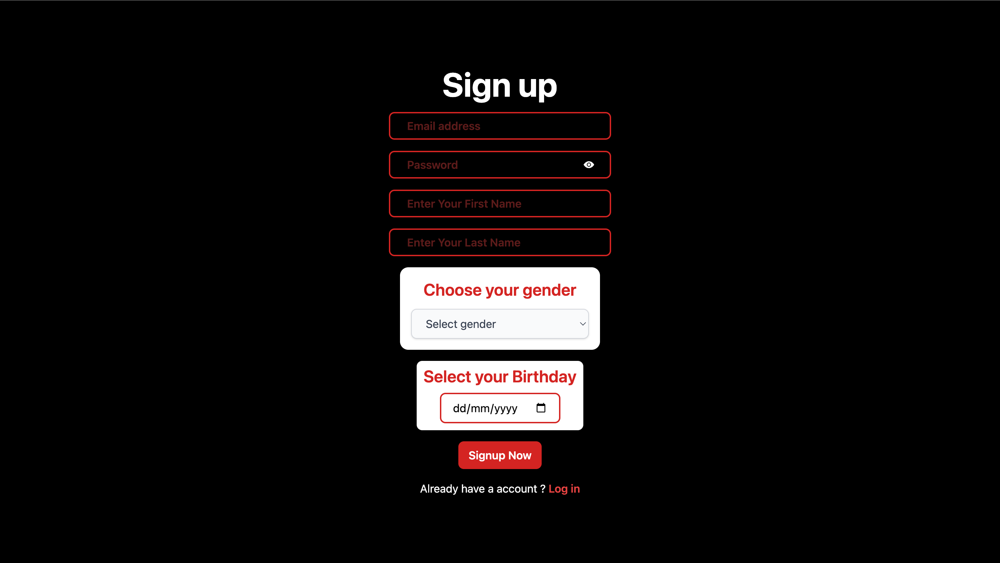
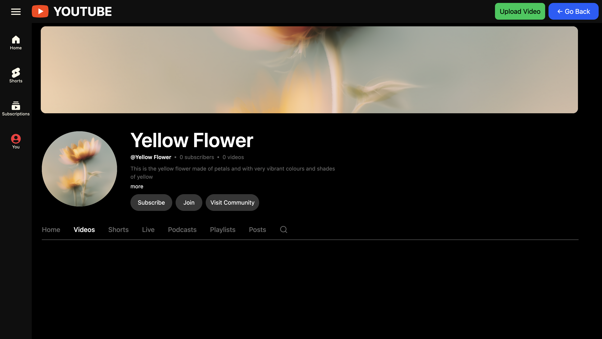
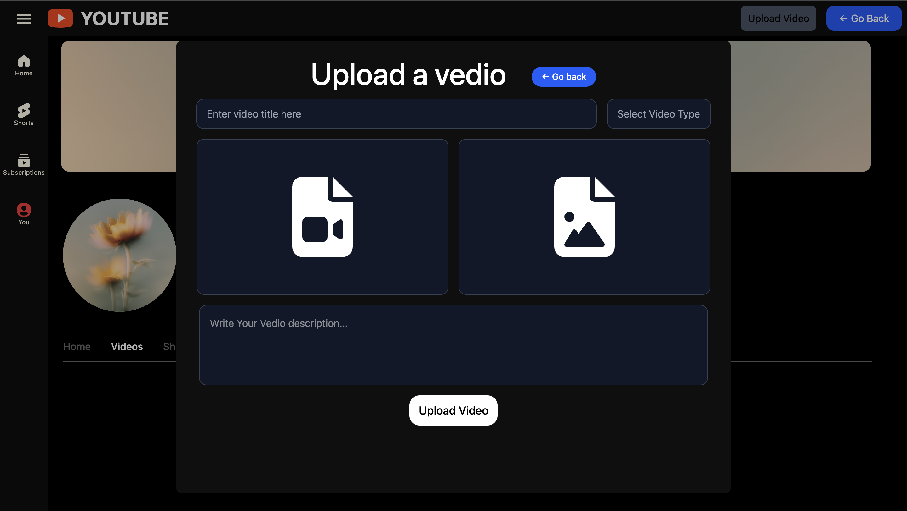

# 📺 YouTube-like Video Platform — Backend API

A backend REST API for a YouTube-inspired video sharing platform built with
**Node.js**, **Express.js**, **TypeScript**, and **Prisma ORM**.
Supports user auth, channel creation, cloud media uploads via
**Cloudflare R2 (S3-compatible)**, and a public video feed.

---
## 📸 Screenshots

| Home Page | Signup Page |
|-----------|-------------|
|  |  |

| Channel Page | Upload Video |
|--------------|--------------|
|  |  |

## 🛠️ Tech Stack

- **Runtime:** Node.js
- **Framework:** Express.js
- **Language:** TypeScript
- **ORM:** Prisma
- **Auth:** JWT (stored in HTTP-only cookies) + Bcrypt
- **Validation:** Zod
- **Cloud Storage:** Cloudflare R2 (via AWS S3 SDK + Presigned URLs)
- **Other:** CORS, Cookie-Parser, Axios

---

## ✨ Features

- 🔐 **Auth** — Signup & Signin with hashed passwords and JWT cookie sessions
- 📺 **Channel Management** — Create your own channel with banner, icon, and description (one channel per user)
- ☁️ **Cloud Uploads via Presigned URLs** — Securely upload videos, thumbnails, banners, and channel icons directly to Cloudflare R2
- 🎬 **Video Management** — Upload video metadata and serve a public video feed (Public videos only)
- 👤 **Channel Info** — Fetch your own or others' channel details including subscriber count and uploaded videos
- 🛡️ **Auth Middleware** — Protected routes using JWT from cookies

---

## 📦 Installation
```bash
npm install
```

## 🚀 Running the Project
```bash
npm run dev
```

---

## ⚙️ Environment Setup

Create a `.env` file in the root of the project and fill in the values:
```env
DATABASE_URL=""
PORT=3000
SECRET_KEY=""
R2_ACCESS_KEY_ID=""
R2_ACCESS_SECRET=""
```

| Variable | Description |
|---|---|
| `DATABASE_URL` | Prisma-compatible DB connection string |
| `PORT` | Port the server runs on |
| `SECRET_KEY` | Secret used to sign JWT tokens |
| `R2_ACCESS_KEY_ID` | Cloudflare R2 access key ID |
| `R2_ACCESS_SECRET` | Cloudflare R2 secret access key |

---

## 🗄️ Database (Prisma)

To view and manage your database visually, run:
```bash
npx prisma studio
```

---

## 📡 API Endpoints

### Auth
| Method | Endpoint | Auth | Description |
|--------|-----------|------|-------------|
| POST | `/signup` | ❌ | Register a new user |
| POST | `/signin` | ❌ | Login and receive a JWT cookie |

### Presigned URLs (Cloudflare R2)
| Method | Endpoint | Auth | Description |
|--------|-----------|------|-------------|
| POST | `/getPresignedUrl` | ❌ | Get presigned URL to upload a video |
| POST | `/getThumbnailPresignedUrl` | ❌ | Get presigned URL to upload a thumbnail |
| POST | `/getBannerPresignedUrl` | ❌ | Get presigned URL to upload a channel banner |
| POST | `/getchannelIconPresignedUrl` | ❌ | Get presigned URL to upload a channel icon |

### Videos
| Method | Endpoint | Auth | Description |
|--------|-----------|------|-------------|
| POST | `/uploadVideo` | ✅ | Save uploaded video metadata to DB |
| GET | `/getAllVedios` | ❌ | Fetch all public videos with channel info |

### Channel
| Method | Endpoint | Auth | Description |
|--------|-----------|------|-------------|
| POST | `/createChannel` | ✅ | Create a channel for the logged-in user |
| GET | `/getChannelStatus` | ✅ | Check if current user has a channel |
| GET | `/getchannelInfo` | ✅ | Get your own channel details + videos |
| GET | `/getothersChannelInfo/:userId` | ❌ | Get another user's channel info |
| GET | `/getOthersChannelVideos/:userId` | ❌ | Get another user's uploaded videos |

---

## 🔐 How Auth Works

1. User signs in via `/signin`
2. A JWT token is issued and stored as an **HTTP-only cookie** (expires in 1 day)
3. Protected routes read the token from the cookie via `authmiddleware`
4. In production, set `secure: true` on the cookie for HTTPS

---

## ☁️ How Cloud Uploads Work

Media is **never uploaded through the backend server** — instead:

1. Frontend requests a **presigned URL** from the backend
2. Backend generates a temporary upload URL pointing to **Cloudflare R2**
3. Frontend uploads the file **directly to R2** using that URL
4. Frontend sends the final public media URL to the backend to save in the DB

This keeps the backend lightweight and avoids large file handling.

---

## 📁 Project Structure
```
├── index.ts            # Main Express app & all route handlers
├── db.ts               # Prisma client instance
├── types.ts            # Zod validation schemas & types
├── authMiddleware.ts   # JWT cookie-based auth middleware
├── .env                # Environment variables (not committed)
└── prisma/
    └── schema.prisma   # Database schema
```
